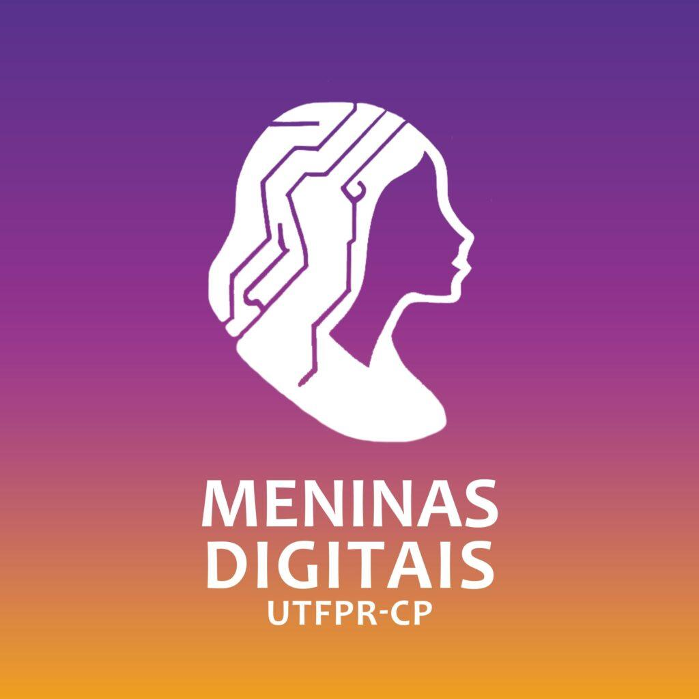

# Sistema de Divulgação e Calendário de Eventos - Meninas Digitais (UTFPR-CP)



## 1. Membros da Equipe
* **Augusto:** Front-end (React, Tailwind CSS, UI/UX)
* **Matheus:** Front-end e Integração
* **Ricardo:** Back-end 
* **José Renato:** Banco de Dados e Autenticação

## 2. Objetivo do Sistema
A plataforma web será um **Sistema de Controle e Gestao de Eventos**, desenvolvido para centralizar e otimizar a divulgação do cronograma de atividades (como oficinas, minicursos e rodas de conversa) do projeto de extensão Meninas Digitais. O sistema atuará como um catálogo digital interativo para o público geral e possui um painel administrativo para a gestão desses eventos.

## 3. Breve Apresentação das Funcionalidades Desenvolvidas
* **Vitrine Pública:** Visualização de todos os eventos disponíveis em formato de cards interativos.
* **Autenticação:** Acesso à área administrativa por meio de uma página de login (a autenticacao sera desenvolvida nas proximas semanas).
* **Dashboard Administrativo:** Painel de controle (total de eventos, próximos eventos, total de vagas).
* **IMPORTANTE: TODOS os dados atuais (informacoes dos cards e do dashboard) vistos nas páginas foram inventados e só existem dentro do código do front-end, visto que ainda nao foi feita a conexao com o back-end. Os cards da página pública e os números do dashboard foram criados apenas para testar a estética das páginas. [08/05/2026]**

## 4. Vídeo de Demonstração
> [COLOQUE O LINK DO VÍDEO DO YOUTUBE AQUI]
*(Vídeo demonstrando a instalação das ferramentas e a execução do sistema em ambiente local).*

---

## 5. Ferramentas, Tecnologias e Bibliotecas

Para garantir a transparência e reprodutibilidade do projeto, listamos abaixo todas as ferramentas utilizadas:

### Ferramentas para Codificar, Compilar e Executar o Projeto
* **Node.js** (v24.12.0) - Ambiente de execução JavaScript. [Link oficial](https://nodejs.org/)
* **Vite** (v5.x) - Ferramenta de build/compilação rápida para projetos web. [Link oficial](https://vitejs.dev/)
* **Visual Studio Code** (Versão mais recente) - IDE recomendada para codificação. [Link oficial](https://code.visualstudio.com/)
* **Git** (Versão mais recente) - Sistema de controle de versão distribuído, necessário para clonar e gerenciar o código-fonte. [Link oficial](https://git-scm.com/)

### Ferramentas para Criar e Hospedar a Base de Dados
* **Supabase** (Versão Cloud) - Plataforma de Backend-as-a-Service (BaaS) open-source. [Link oficial](https://supabase.com/)
* **PostgreSQL** (v15+) - Sistema de gerenciamento de banco de dados relacional (motor por trás do Supabase). [Link oficial](https://www.postgresql.org/)

### Bibliotecas e Ferramentas Complementares (Necessárias para Execução)
* **React** (v18.x) - Biblioteca para construção das interfaces. [Link oficial](https://react.dev/)
* **Tailwind CSS** (v4.0) - Framework CSS utilitário para estilização. [Link oficial](https://tailwindcss.com/)
* **React Router DOM** (v6.x) - Gerenciador de rotas e navegação da aplicação. [Link oficial](https://reactrouter.com/)
* **Lucide React** (v0.x) - Pacote de ícones leves. [Link oficial](https://lucide.dev/)
* **Supabase JS Client** (v2.x) - Biblioteca para conectar a aplicação ao banco de dados. [Link oficial](https://supabase.com/docs/reference/javascript/installing)

#### Observação Importante:
* Os seguintes itens já serao(e devem ser) automaticamente baixados pelo comando *npm install* após a clonagem do repositório(confira no tópico 7):
- React
- Tailwind CSS
- React Router DOM
- Lucide React
- Supabase JS Client
- Vite
---

## 6. Roteiro para Criar e Executar a Base de Dados

Como o projeto utiliza o Supabase como serviço gerenciado, a base de dados fica na nuvem. Siga os passos para replicar o banco:

1. Acesse o [Supabase](https://supabase.com/) e crie uma conta gratuita.
2. Clique em **"New Project"**, defina um nome, uma senha segura para o banco e selecione a região mais próxima (ex: São Paulo).
3. Aguarde o projeto ser provisionado (pode levar alguns minutos).
4. No menu lateral esquerdo, vá em **"SQL Editor"** e clique em **"New Query"**.
5. Inserir o script SQL de criação das tabela.
6. Clique em **"Run"** para criar a estrutura do banco de dados.
7. Criado o schema base do SQL partiremos para a conexão da API nas próximas etapas. Para isso utilizaremos o menu **Integrations** e a **Data API** gerada com base no schema.
8. EM BREVE...

---

## 7. Roteiro para Salvar o Código, Compilar e Executar a Aplicação

Com as ferramentas pré-requisitos (Node.js e Git) instaladas na máquina, siga o passo a passo em seu terminal:

1. **Clonar o código-fonte:**
   ```bash
   git clone [https://github.com/augustoosa/Certificadora_da_Competencia_3](https://github.com/augustoosa/Certificadora_da_Competencia_3)
   cd meninas-digitais
   ```
2. **Compilar/Instalar as dependências do projeto:**
   No seu terminal, confirá se está dentro da pasta "meninas-digitais", e rode o comando:
   `npm install`

3. **Executar a aplicação:**
   No mesmo terminal, rode o comando:
   `npm run dev`

4. O terminal exibirá um endereço local (geralmente `http://localhost:5173`). Segure a tecla `Ctrl` e clique no link para abrir o sistema no navegador.

---

## 8. Roteiro a ser seguido para Testar o Sistema

OBS: O projeto ainda está em desenvolvimento, a grande maioria dos botoes ainda nao apresentam funcionalidade, visto que elas serao implementadas futuramente até a Entrega final.

* Siga esta sequência lógica para validar todas as páginas do projeto:

1. **Teste da Vitrine Pública:**
   * Abra o sistema (`http://localhost:5173`).
   * Navegue pela página inicial e verifique se a lista de eventos (cards) carrega corretamente.
   
2. **Teste de Navegação para Área Administrativa:**
   * No cabeçalho superior direito, clique em **"Espaço da Equipe"**.
   * Você deve ser redirecionado para a página de Login (`/login`).

3. **Teste de Login:**
   * O sistema ainda nao possui nenhum método de autenticacao, entao nao é necessário escrever email nem senha para poder vizualizar a próxima página
   * Clique em "Entrar". Você deve ser redirecionado para o Painel Administrativo (`/admin`).

4. **Teste de Gestão de Eventos:**
   * No Dashboard, observe as métricas e a listagem de eventos.
   * Clique no botão **"Novo Evento"**.
   * O modal de cadastro deve abrir na tela, com os campos obrigatórios (Título, Tipo, Data, Local).

## Estrutura de Pastas Padrão

Para mantermos a organização do projeto, sempre crie seus arquivos nos locais corretos dentro da pasta `src/`:

- `components/`: Componentes reutilizáveis (botões, cards, modais genéricos).
- `pages/`: As páginas completas (Home, Calendário, Painel Admin).
- `services/`: Comunicação com APIs externas e com o banco Supabase.
- `types/`: Tipagens do TypeScript (como as interfaces das tabelas).
- `utils/`: Funções auxiliares puras (ex: formatador de data, validador de formulário).

---

## Fluxo de Trabalho (Git Flow)

**⚠️ NUNCA trabalhe direto na branch `main`.** A branch `main` é sagrada e apenas para código 100% pronto e revisado.

1. Todo o nosso desenvolvimento se une na branch **`develop`**.
2. Quando for assumir uma nova tarefa (ex: criar a listagem de eventos), crie uma branch a partir da `develop`:

```bash
git checkout develop
git pull origin develop
git checkout -b feat/nome-da-sua-tarefa
```

3. Ao finalizar, faça o push da sua branch e abra um **Pull Request (PR)** no GitHub apontando para a branch `develop`. Peça para pelo menos um colega revisar antes de aprovar.
